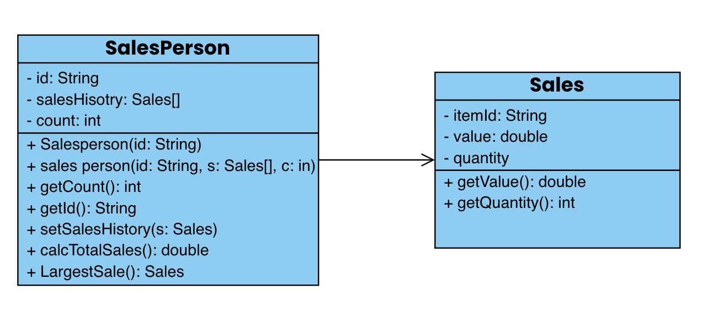

# Forum-Activity-Class-Design-and-Implementation-Case
# Andrew Sebastian Sibuea 2602169711

1.) a. A class is a blueprint or template that defines the attributes and behaviors of a specific type of object. An instantiation of a class refers yo creating an actual objecy based on that class. The class represents a general concept, while instantiation represents a specific instance of the class. For example, in the administration program of a company with different locations, there may be a class called "product" that defines the attributes of a product such as name, price, and quantity. An instantiation of this class would be creating a specific product object, such as "boxing glove". The class "product" serves as a blueprint for all products, while "boxing glove" represents a specific instance of the product. 

   b.  GUI Inheritance:
The administration program may have different GUI modules for managing various aspects. These modules may share common design elements and functionality. By implementing inheritance, a base GUI class can be created with common attributes and methods. Specific GUI modules, such as "SalesGUI" can inherit from the base class, inheriting the shared functionality and customizing it as needed.

Employee Inheritance:
The administration program handles the salaries of managers, office staff, and sales personnel. These employee types may have common attributes like name and ID, as well as shared behaviors like salary calculation. Inheritance can be applied by creating a base "Employee" class with shared attributes and methods. Then, specific employee types, such as "Manager," "OfficeStaff," and "SalesPerson," can be derived from the base class, inheriting the common features and implementing their unique functionalities.

   c. Libraries play a crucial role in facilitating the development of programs like the administration program. They provide pre-existing code and functionality that can be leveraged to simplify development and enhance efficiency. By utilizing libraries, the administration program can save development time, reduce complexity, and benefit from well-tested and optimized code.
   
  2.) c. (i) 
  

